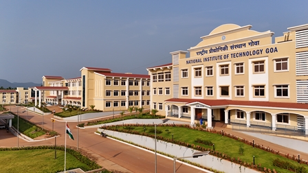

<div style="text-align: center;">
    <h1>NLTM - National Institute of Technology GOA</h1>
</div>
  
<!-- ABOUT THE PROJECT -->


## Dialect Identification for Indian Languages

<p align="center">
  
</p>


### Introduction

<p style="text-align: justify;">
The focus of the work at <a href="https://www.nitgoa.ac.in/">National Institute of Technology Goa</a> is on Spoken Language Identification with a focus on development of Dialect Identification System. The task of spoken language identification (LID) involves automatically identifying the language in which a given speech utterance was spoken. An important aspect of a spoken language is its dialects. Dialects of a given language are differences in speaking style of the first language or native language (L1) because of geographical and ethnic differences.
</p>

### Mission

<p style="text-align: justify;">
Dialect of a speech utterance acts as a virtual geo-tag for the utterance that helps in predicting the geographical location to which a speaker belongs. The dialectal variations of a spoken Indian language are a matter of concern for any automatic processing of speech utterances from that language. The project aims at addressing the issues of identifying the dialect in the conversational speech of the Indian languages. Dialect identification is difficult when compared to LID due to high interclass similarity among the dialects of a language. We also propose to explore deep learning methods for the dialect identification task.
</p>

##  Indian Language Dialect Identification Models

### Architecture

In our Dialect Identification system, we employ a tandem approach, leveraging two distinct models: a feature extractor and a predictor model.

1. Feature Extractor: </br>
Our feature extractor is based on the [wav2vec2 architecture](https://github.com/NLTM-NITG/Dialect-Identification/blob/main/wav2vec2_model.pth), which is hosted on HuggingFace and developed by Facebook. This model is specifically designed for extracting high-quality acoustic features from raw audio data. For more details on the wav2vec2 model, please refer to the documentation provided by [HuggingFace here.](https://huggingface.co/docs/transformers/en/model_doc/wav2vec2) 

2. Predictor Model: </br>
The predictor model utilized in our system is a U-vector model, as defined in the research paper titled "Exploring the Impact of Different Approaches for Spoken Dialect Identification of Konkani Language" by Sean Monteiro et al. This model has been developed to effectively identify dialects in spoken language, with particular focus on the Konkani language. For further insights into this model and its methodologies, you can refer to the [publication.](https://dblp.org/db/conf/specom/specom2023-2.html)

By integrating these two models, our Dialect Identification system achieves robust performance in accurately identifying dialects across various Indian languages, including Marathi, Konkani, Tamil, Kannada, and others.

### Weights

The model weights are stored as a .pth file. These weights encapsulate the learned parameters of the [Dialect model](https://github.com/NLTM-NITG/Dialect-Identification/blob/main/Model_Marathi.pth), which have been derived from an extensive dataset encompassing various Indian languages such as Marathi, Konkani, Tamil, Kannada, and others. See readme at [HuggingFace](https://huggingface.co/NLTM-NITG/Dialect_Identification_Indian_Languages_Marathi/blob/main/Dialect_Identification_Indian_Languages_Marathi.pth) for precise information for each Indian language.

### Benchmark details

Our model's validity is assessed using a range of [metrics](https://scikit-learn.org/stable/modules/model_evaluation.html), particularly Confusion Matrix, Accuracy, True Positive Rate (Recall), False Positive Rate, False Negative Rate, Precision, F1 Score, and Equal Error Rate (EER).

## Demo 
### HuggingFace
<hr>

1. Download the models from [Github CLI](https://github.com/NLTM-NITG/Dialect-Identification/tree/main?tab=readme-ov-file#command-line-interface-cli) or [HuggingFace](https://huggingface.co/NLTM-NITG/Dialect_Identification_Indian_Languages_Marathi).
2. Rename the paths to the models and to your corresponding audio file.
3. Instance a model object: model = DID_Model().
4. Load the weights for the model by running: model.load_weights(model_path).
5. Predict the dialect through inference: model.predict_dialect(aud_path, wave2vec_model_path).

### GUI Website 
<hr>

<strong>[View Deployment](https://nltm-nitg.github.io/Dialect-Identification/)</strong>

For more information on Demo/Inference/Finetuning: [NIT Goa - Dialect Identification Website](https://github.com/NLTM-NITG/Dialect-Identification/blob/main/Website/GUI%20Website.md)


>[!NOTE]
>#### 🛠Built With
>
>-   🌐 &nbsp; Frontend </br>
>    
>    
>    
>-   🧾&nbsp; Backend </br>
>    
>    
>    
>    
>    


### Command Line Interface (CLI) 
<hr>

#### Overview
The Dialect Identification system comprises a Graphical User Interface (GUI) website and a Command Line Interface (CLI) designed for identifying the Dialect of spoken audio utilizing a u-vector model. The GUI facilitates various tasks such as audio recording, playback of saved audio files, and Dialect identification of spoken audio. On the other hand, the CLI enables users to predict the Dialect of individual audio files or directories containing multiple audio files.


#### **Setup**
1. Clone the Repository: Obtain the system source code by cloning the repository from GitHub:

```sh
git clone https://github.com/NLTM-NITG/Dialect-Identification
```
    
2. Navigate to the CLI Directory: Access the Command Line Interface directory within the cloned repository:

```sh
cd Dialect-Identification/CLI
```
3. Install the requirements for CLI to run by running requirements.txt
   
```sh
pip install requirements.txt
```
   
#### **Running the CLI Scripts**

To predict the Dialect of audio files using the Command Line Interface, execute the following command:
   
```sh
python demo.py <path/to/audio_file_or_directory>
```
   
Replace `<path/to/audio_file_or_directory>` with the path to the audio file or directory containing audio files with the '.wav' extension.


#### **Output**

- If a directory is specified, the predicted languages for each audio file will be displayed in the console.
- A CSV file named `Predicted_Dialect.csv` will be generated in the current directory, containing the audio filename and predicted language for each audio file.

<hr>

####  **Performance Metrics Calculation**

To calculate performance metrics follow these steps:


1. Add Actual Language Labels: Ensure that the actual language labels of each file are included in the `Predicted_Dialect.csv` file under the column named `Dialect`.


2. Run the Performance Metrics Script: Execute the `Prediction_Metrics.py` script with the following command:

```sh
python Prediction_Metrics.py --CSV_File_Name <path/to/Predicted_Dialect.csv>
```

Replace `<path/to/Predicted_Dialect.csv>` with the path to the `Predicted_Dialect.csv` file containing the predicted language labels.


#### **Output**

- The script will produce the calculated [performance metrics](https://github.com/NLTM-NITG/Dialect-Identification/tree/main?tab=readme-ov-file#benchmark-details), which will be displayed in the console.

<hr>
  
### Limitation
These models are trained are trained on a number of Indian Languages for a variety of dialects. Therefore, these models may fail in the following conditions.

- Presence of unfamiliar dialects and accents.
- Presence of high domain mismatch.
- Contains too much noise and unclear speech.
- Does not belong to the dialects of Puneri or Marawadi in Marathi Language.
- Minimum duration of audio is not around 2-4 seconds for accurate Dialect identification.


<!-- CONTACT -->
## License

This project is licensed under the [NLTM Creative Commons CC-BY-4 LICENSE](LICENSE) file for details.

## Contact

- [Dr.Veena T.](https://www.nitgoa.ac.in/)
- [EvanderDS](https://www.linkedin.com/in/evanderds/)
 
## Acknowledgement

This work is performed with the support of the project named "Speech Technologies In Indian Languages". It is part of the NLTM (National Language Technology Mission) consortium project which is sponsored by Meity (Ministry of Electronics and Information Technology), India.


